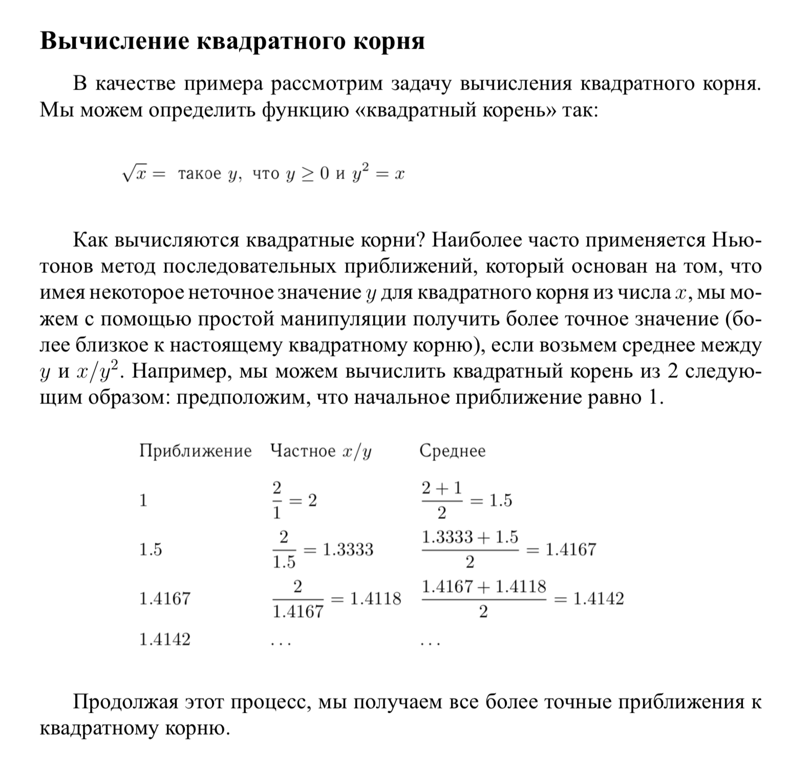
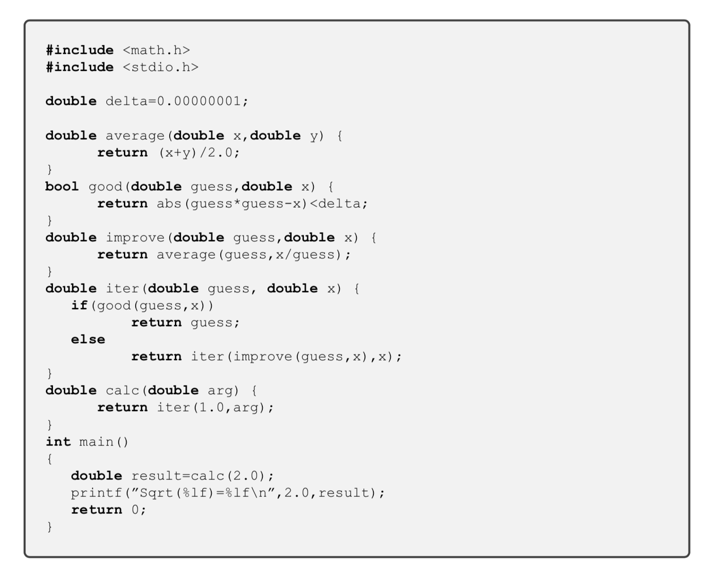

# **Ex02** Написание модульных тестов


## Задача №1

```
    Написать программу, вычисляющую квадратный корень числа методом Ньютона
```


### Теоретическая часть




### Текст программы




### Тесты

Необходимо написать тесты, покрывающие основной функционал программы (не менее 10 штук). Тесты должны включать проверку точности результата (до требуемого знака).


### Состав программы

Программа должна состоять из 3-х файлов:

- **task1.h** - заголовочный файл, содержащий заголовок 
- **task1.cpp** - файл, содержащий реализацию функций
- **main1.cpp** - файл, содержащий диалог с пользователем.
- **test_lab1.cpp** - файл с тестами

