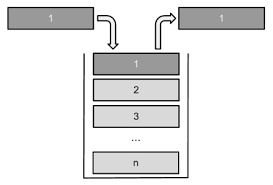

# Ex09 Разработка шаблона класса Stack


Структура данных **Стек** является широко известной и очень распространенной. В ее основе лежит принцип доступа к элементам по названием **LIFO** - последний пришел, первый вышел.



Элементы помещаются и извлекаются с головы стека (~top~)

Реализация на массиве предполагает выбор типа массива:

- На массиве фиксированной длины (статическом массиве)
- На массиве переменной длины (динамическом массиве)


### Задача №1

> Разработать шаблон класса MyStack. 

Хранение данных осуществляется в динамическом массиве.

Шаблон класса должен содержать следующие методы:

- конструктор с одним параметром.
- конструктор копирования.
- деструктор.
- **get() const** - возвращение эелемента на вершине стека (без изменения состояния последнего).
- **pop()** - выталкивание элемента из стека.
- **push()** - добавление элемента в стек.
- **isFull() const** - проверка заполненности стека.
- **isEmpty() const** - проверка пустоты стека.

*Примечание*

Шаблон стека можно использовать следующим образом:

```cpp
#include "MyStack.h"

int main()
{
    MyStack<int> st(10);
    st.push(rand());
    st.push(rand());
    st.push(rand());

    while(!st.isEmpty())
       std::cout << st.pop() <<" ";
    return 0;
}
```

### Задача №2

> Написать демонстрационную программу с использованием класса **MyStack**

### Задача №3

> Разработать не менее 10 Unit-тестов для проверки работы стека.
 
